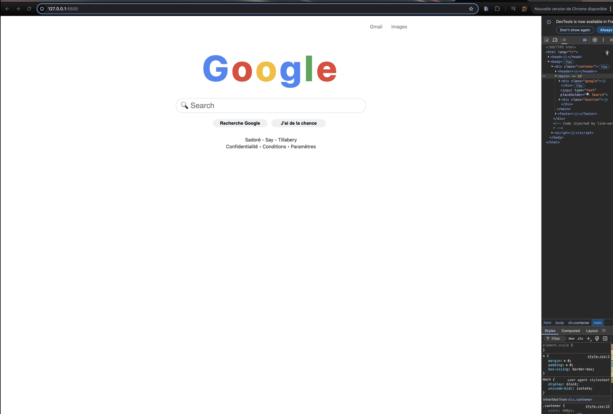

## Description du Projet

Ce projet est une **reproduction statique** de la page d'accueil classique du moteur de recherche Google. Il s'agit d'un exercice d'intégration front-end visant à recréer l'interface utilisateur (UI) avec une attention particulière au design, aux couleurs, à la typographie, et à la **réactivité** sur différents appareils.

L'objectif principal était de maîtriser le positionnement des éléments, l'application du schéma de couleurs emblématique de Google, et l'adaptation de la mise en page (Responsive Design).

## Fonctionnalités Implémentées

* **Logo Google** : Recréation du logo avec les couleurs exactes (`.G`, `.O`, `.o`, `.g`, `.l`, `.e`) en utilisant Flexbox pour l'alignement.
* **Barre de Recherche** : Champ de saisie stylisé avec un effet de survol (`:hover`) qui modifie la bordure.
* **Boutons** : Implémentation des boutons "Recherche Google" et "J'ai de la chance" avec un effet de survol subtil (`box-shadow`).
* **En-tête (`<header>`) et Pied de Page (`<footer>`)** : Liens et informations de bas de page stylisés et positionnés.
* **Responsive Design** : L'interface s'adapte aux écrans de taille moyenne (tablette - $768\text{px}$) et aux petits écrans (smartphone - $425\text{px}$).

## Technologies Utilisées
* **HTML5**: Fournit la structure sémantique de la page.
* **CSS3**: Style de l'interface, incluant Flexbox pour le centrage et le positionnement des éléments.

## Aperçu du travail
